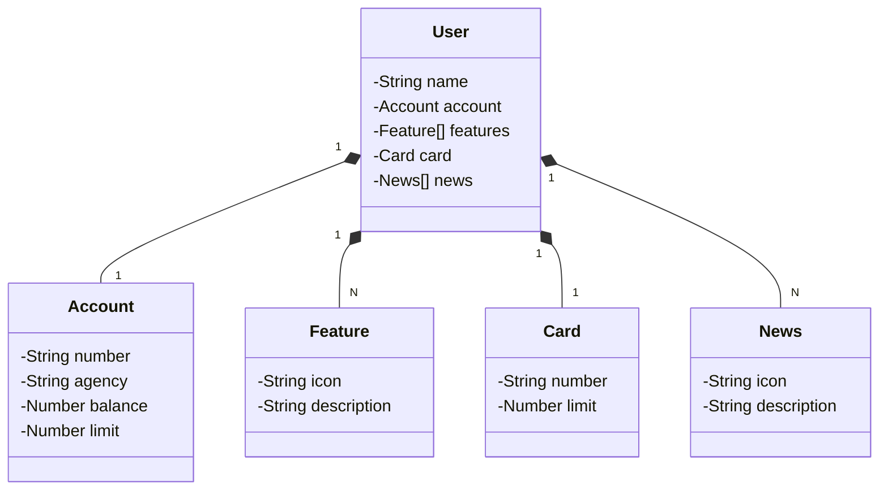

<<<<<<< HEAD
## Diagrama de Classes
=======
# 🏦 API RESTful de Cadastro de Contas Bancárias

Este projeto é uma **API RESTful** desenvolvida em **Java 23** utilizando o **Spring Boot**, com gerenciamento de **contas bancárias** em um banco de dados **PostgreSQL** hospedado no **Railway**.

Este projeto foi criado como parte de um **desafio da DIO (Digital Innovation One)**, com foco em boas práticas de desenvolvimento de APIs modernas com Spring.

---

## 🚀 Tecnologias Utilizadas

- Java 23
- Spring Boot
- Spring Web
- Spring Data JPA
- PostgreSQL (Railway Cloud)
- Gradle
- Swagger (OpenAPI)
- Railway (Deploy em nuvem)

---

## 📂 Funcionalidades

- ✅ Cadastro de novas contas bancárias  
- ✅ Listagem de contas cadastradas  
- ✅ Busca de conta por ID  
- ✅ Atualização de dados da conta
  
---

## Diagrama de Classes (Domínio da API)
>>>>>>> 83b83bf4719d137d0b58b6b53871cdb2017d8498

<<<<<<< HEAD
=======
---

Este documento contém capturas de tela que demonstram o funcionamento da API, tanto no banco de dados quanto na interface Swagger.

## 📌 1. Tabelas Criadas no PostgreSQL

Este print mostra as **tabelas criadas automaticamente** no banco de dados PostgreSQL hospedado no **Railway**, através da configuração do Spring Data JPA.

As tabelas refletem as entidades mapeadas no projeto (por exemplo, `conta`, `cliente`, ou similares), garantindo a persistência das informações cadastradas via API.

---

## 📌 2. Swagger - API em Execução

Este print mostra a **interface do Swagger UI**, confirmando que a API está rodando corretamente e que os endpoints estão expostos na web.

---

## 💡 O que eu aprendi com esse projeto

Este projeto foi uma excelente oportunidade para colocar em prática diversos conhecimentos adquiridos durante minha jornada de estudos em desenvolvimento de software. Com ele, pude:

- Reforçar a criação de APIs RESTful com Java e Spring Boot.
- Trabalhar com banco de dados PostgreSQL em nuvem usando o Railway.
- Utilizar Gradle como gerenciador de build no Java 23.
- Integrar o Swagger para documentação e testes da API.
- Aplicar boas práticas de organização de código e estrutura de pastas.
- Entender melhor o processo de deploy e build de aplicações em containers.

Além disso, esse desafio me proporcionou uma vivência mais próxima de como funciona o desenvolvimento de sistemas reais, conectando back-end com banco de dados e preparando a aplicação para produção.

## 🙌 Agradecimentos

Gostaria de agradecer à **Digital Innovation One (DIO)** por proporcionar esse desafio, que foi essencial para meu crescimento profissional e técnico.

---

🔗 **Siga meu GitHub** para mais projetos como esse!  
🚀 **Vamos evoluir juntos!**
>>>>>>> 83b83bf4719d137d0b58b6b53871cdb2017d8498
